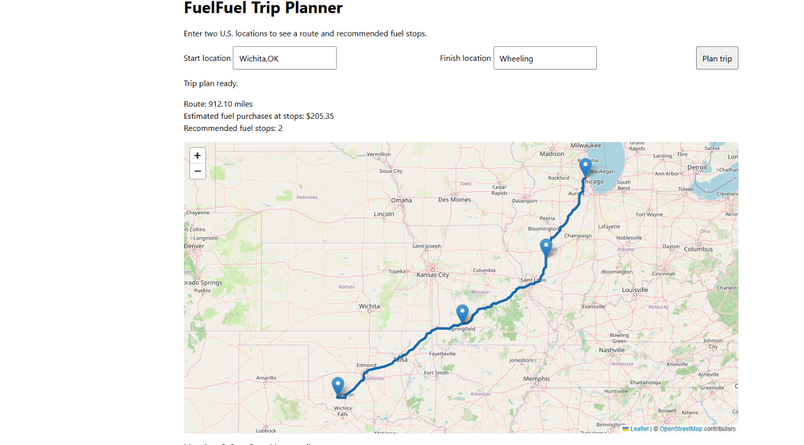

# fuelfuel-route-optimizer

FuelRoute API is a Django-based REST API that calculates an optimal, cost-effective fueling strategy for road trips across the USA.

## Packages

| Package | Why |
| --- | --- |
| `django` | Backend framework |
| `djangorestframework` | Build the API |
| `drf-spectacular` | OpenAPI/Swagger documentation |
| `httpx` | Call the routing API |
| `django-environ` | `.env` configuration |
| `pytest` | Testing |
| `pytest-django` | Django testing with pytest |
| `django-debug-toolbar` | Debug SQL/performance |
| `pylint` | Code quality |
| `black` | Formatting |
| `isort` | Import formatting |
| `django-nplusone` | Detect N+1 queries; optional |
| `psycopg` | PostgreSQL driver |

## Setup and Run

Install dependencies with `uv sync`. Configure PostgreSQL in `.env`; use `.env.example` as a reference. As a PostgreSQL administrator, run `psql -U postgres -d postgres -f data/create_postgres.sql` to create the application role and database. The role is granted `CREATEDB` so pytest can create its dedicated test database.

Test-only connection overrides belong in the ignored `.env.test.local`. `.env.test` remains the non-secret test template; the test database is named `test_fuelfuel_route_optimizer`.

Apply migrations and start the local server:

```powershell
uv run python manage.py migrate
uv run python manage.py runserver
```

The health endpoint is `http://127.0.0.1:8000/api/health/` and returns `{"status":"ok"}` when the service is running. Set `ENABLE_NPLUSONE=True` in `.env` to enable local N+1 profiling; it is disabled in tests and other environments. Django Debug Toolbar is available locally while `DEBUG=True`.

## Trip-planning API and map

Create a route and fuel-stop plan with:

```http
POST /api/trips/plan/
Content-Type: application/json

{
  "origin": "New York, NY",
  "destination": "Chicago, IL"
}
```

The trip planner processes a request in this order:

1. Geocode the origin and destination with Nominatim.
2. Request the road route, distance, and GeoJSON geometry from OSRM.
3. Load fuel stations and their stored prices from PostgreSQL.
4. Find stations within 10 miles of the route and project them onto the route.
5. Apply the vehicle's 500-mile maximum range, accounting for fuel already in
   the tank.
6. Repeatedly select the lowest-priced reachable station; when prices tie, the
   farther station is preferred. Continue until the destination is reachable.
7. Calculate the estimated cost of fuel purchased at the recommended stops.
8. Return the route, stops, and cost if a complete itinerary is feasible.

Successful responses include the route as GeoJSON `LineString` geometry, route
distance in miles, recommended fuel stops, and `total_fuel_cost`. The starting
tank is assumed full (500-mile range at 10 MPG), so the total does not count fuel
purchased before the trip. If the location cannot be found, the route cannot be
calculated, or no complete fuel-stop itinerary is possible, the API returns an
error rather than a partial plan.

Open `http://127.0.0.1:8000/api/trip-planner/` for a basic interactive map. It
submits the same API request, draws the returned GeoJSON route, and marks the
origin, destination, and recommended fuel stops. The page uses Leaflet to render
the GeoJSON route over OpenStreetMap tiles.

Example Leaflet map showing a route and its recommended fuel stops:



Nominatim coordinates are cached for 30 days, and cache misses are rate-limited
to at most one Nominatim request per second. Configure a shared Django cache in
multi-process deployments so those protections apply across workers. Provider
URLs and the identifying Nominatim User-Agent can be overridden with
`NOMINATIM_SEARCH_URL`, `NOMINATIM_USER_AGENT`, and `OSRM_ROUTE_URL` environment
variables. A complete successful trip result is cached for five minutes by the
normalized, ordered origin/destination pair; set `TRIP_PLAN_CACHE_SECONDS` to
change this period. Cached results include the fuel prices and costs, so they
may remain unchanged until the cache expires. The default OSRM public demo
server is best-effort; use an appropriate hosted or self-managed service for
production traffic. Attribute OpenStreetMap data on the map.

The map also shows higher-priced station alternatives in red when they have
coordinates and a price, lie within 10 miles of the route, and are reachable
within the same 500-mile (or remaining initial-fuel) window as a recommended
stop. The popup displays their price and route mile marker.

### Free public services and usage requirements

The planner uses these free public APIs over HTTP via `httpx`; they are not
Python libraries.

**Nominatim — geocoding**

- Send an identifying `User-Agent` and make no more than one request per second.
- Do not use the public service for large or recurring bulk geocoding; see the
  [Nominatim usage policy](https://operations.osmfoundation.org/policies/nominatim/).
- Attribute OpenStreetMap when displaying its data.

**OSRM — road routing**

- The public demo server is best-effort and has no production availability
  guarantee.
- Avoid bulk or high-volume requests; use a hosted or self-managed service for
  production traffic.
- Follow the [OSRM routing API documentation](https://project-osrm.org/docs/v5.24.0/api/#route-service)
  for supported request parameters and response formats.

## Seeding fuel stations

Run `uv run python manage.py seed_stations` to load station and retail-price rows
from `data/fuel-prices-for-be-assessment.csv`. You can pass a different CSV path
as the first argument. Duplicate OPIS IDs are consolidated, with the last CSV
row supplying that station's values.

### CSV duplicate and cleaning notes

The supplied CSV contains 8,151 rows and 6,738 distinct OPIS IDs. There are 678
OPIS IDs with repeated rows, accounting for 1,413 rows beyond one row per ID.
Within those repeated-ID groups:

- 597 IDs have more than one retail-price value.
- 227 IDs appear with more than one truckstop name.
- The repeated rows for a given OPIS ID agree on address, city, state, and
  rack ID.
- There are 26 exact duplicate extra rows where all listed station and price
  values repeat.

This pattern suggests the repeated OPIS IDs refer to the same station, not
different stations: station location/rack details match, while some names vary.
The CSV has no date, fuel-type, or price-source column, so it is not possible to
tell whether differing prices are from different dates, fuel types, or another
source distinction. A rack ID is not a unique station identifier either: rack
IDs are shared by multiple OPIS IDs in the file.

The current seed command creates one station and one current price per OPIS ID;
for repeated IDs, the last CSV row wins. This means earlier price values,
alternate names, and exact duplicate rows are not stored separately. Preserve
the original CSV if those details are needed for analysis.

### How station geodata is geocoded

The seed command first writes all station and retail-price rows to the database,
then fills station latitude and longitude from the CSV's address, city, and
state. That way the station table has data even while the slower geocoding work
is still running:

1. It builds one search query per distinct `address, city, state, USA` location.
2. It sends each query to the
   [Nominatim Search API](https://nominatim.org/release-docs/develop/api/Search/)
   with `format=jsonv2`, `limit=1`, and `countrycodes=us`.
3. Each location result is saved to the database as it is processed. If there
   is no result, the station's coordinates are left blank.

The geocoder uses the
[Nominatim public-service policy](https://operations.osmfoundation.org/policies/nominatim/):
requests run sequentially at no more than one per second, with an
identifying User-Agent. The full dataset can take hours to geocode. Run only
one process on one machine, do not schedule repeated bulk imports, and do not
exceed the request limit. The public service discourages larger or recurring
bulk geocoding; use another provider or a self-hosted Nominatim instance for
those cases. Use `--nominatim-url` to select a different compatible endpoint.

OpenStreetMap data is © OpenStreetMap contributors and is available under the
[ODbL](https://www.openstreetmap.org/copyright). Attribute OpenStreetMap when
displaying geocoded data.

## Fuel-stop planning

`from routes.services import plan_trip_fuel_stops` is the main service entry
point. Calling `plan_trip_fuel_stops(trip)` calculates and saves an ordered,
multi-stop itinerary. The trip must already have a route distance and GeoJSON
`LineString` route geometry, and candidate stations need coordinates and a fuel
price.

Stations more than 10 miles from the route are ignored. Starting with the
trip's available fuel, the planner repeatedly considers reachable stations,
selects the lowest-priced one (preferring the farthest station when prices
tie), and continues until the destination is within range. Fuel prices and
estimated costs are recorded for each stop. A trip reachable on its starting
fuel gets no recommended stops. If stations cannot form a complete itinerary,
planning raises an error instead of saving a partial plan.

## API Documentation

- OpenAPI schema: `/api/schema/`
- Swagger UI: [http://127.0.0.1:8000/api/docs/](http://127.0.0.1:8000/api/docs/)
- ReDoc: `/api/redoc/`

## Tests

Run tests with `uv run pytest`. Pytest uses `core.test_settings` and `--reuse-db` to create the test database on its first database-backed test run and reuse it afterward. Run `uv run pytest --create-db` to recreate it after database migrations change.
